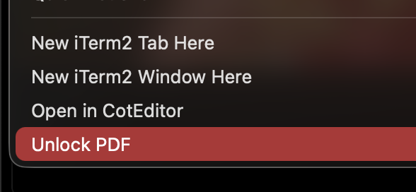

<div align="center">

# Unlock PDF for macOS

**Right-click any password-protected PDF in Finder and unlock it instantly.**

Adds a native **Unlock PDF** option to the macOS context menu — no apps to open, no online uploads, no subscriptions.



[](https://www.apple.com/macos/)
[](LICENSE)
[](https://github.com/qpdf/qpdf)
[](#contributing)

</div>

---

## Why this exists

You have a PDF you own — a bank statement, a scanned form, a manual — and you cannot copy text from it, print it, or merge it with another PDF because it's locked. Online "PDF unlocker" sites want you to upload private documents to a stranger's server. Desktop apps want $30 and a subscription.

This repo is a **30-second install**, **zero-cloud**, **fully-local** tool that drops an `Unlock PDF` button into your right-click menu. Pick a PDF, click, get an unlocked copy next to the original. Done.

## Features

- **Right-click in Finder** — no terminal needed after install
- **Batch support** — select multiple PDFs, unlock all in one click
- **Local & private** — your files never leave your Mac
- **Non-destructive** — original is preserved; output is `<filename>-unlocked.pdf`
- **Tiny** — one shell script, one Automator Quick Action, no daemons

## Install

One line. Paste it into Terminal:

```bash
curl -fsSL https://raw.githubusercontent.com/vipulgupta2048/unlock-pdf-mac/main/install.sh | bash
```

The installer will:

1. Install [`qpdf`](https://github.com/qpdf/qpdf) via Homebrew if it's not already present
2. Drop the `Unlock PDF.workflow` into `~/Library/Services/`
3. Register the Quick Action with macOS

That's it. Right-click any PDF and you'll see **Unlock PDF** in the menu (sometimes nested under **Quick Actions** or **Services** depending on your macOS version).

## Usage

1. **Find a locked PDF** in Finder
2. **Right-click** → **Unlock PDF** (or **Quick Actions → Unlock PDF**)
3. An unlocked copy appears next to the original, suffixed with `-unlocked`

That's the entire workflow.

### Multiple files at once

Select several PDFs, right-click, **Unlock PDF**. Each one gets its own unlocked copy.

### Owner-password vs user-password PDFs

| PDF type | What it means | Works? |
|---|---|---|
| **Owner-locked** (no password to open, but copy/print disabled) | The most common annoyance — bank statements, manuals | Yes, automatic |
| **User-locked** (password required to open) | You'll be prompted for the password | Yes |

## How it works

```
Finder right-click
       ↓
macOS Quick Action ("Unlock PDF.workflow")
       ↓
shell script → qpdf --decrypt input.pdf input-unlocked.pdf
       ↓
Unlocked PDF in the same folder
```

The heavy lifting is done by [`qpdf`](https://github.com/qpdf/qpdf), the de-facto open-source library for PDF transformations. This repo is a thin macOS-native wrapper that exposes it as a right-click action.

## Manual install (if you don't want to pipe to bash)

```bash
# 1. Install qpdf
brew install qpdf

# 2. Clone this repo
git clone https://github.com/vipulgupta2048/unlock-pdf-mac.git
cd unlock-pdf-mac

# 3. Run the installer
./install.sh
```

Or copy `automator/Unlock PDF.workflow` into `~/Library/Services/` by hand.

## Uninstall

```bash
rm -rf ~/Library/Services/"Unlock PDF.workflow"
```

Optionally `brew uninstall qpdf` if you don't use it for anything else.

## Use from the command line

If you don't want the Finder integration, the underlying script works standalone:

```bash
./scripts/unlock-pdf.sh ~/Documents/locked.pdf
# → ~/Documents/locked-unlocked.pdf
```

## FAQ

<details>
<summary><b>Is this legal?</b></summary>

Removing restrictions from PDFs you legally own and have the right to access is generally fine in most jurisdictions. Removing DRM from copyrighted material you don't own is not. **Use this on your own documents.** I'm not a lawyer; check your local laws.
</details>

<details>
<summary><b>Does this break encryption / crack passwords?</b></summary>

No. `qpdf --decrypt` removes restrictions from PDFs that have an *owner password* but no *user password* (the most common case). For PDFs that require a password to open, you'll be prompted to enter it — this tool does not crack or guess passwords.
</details>

<details>
<summary><b>Why does the menu say "Quick Actions" instead of showing "Unlock PDF" directly?</b></summary>

Newer macOS versions group third-party services under **Quick Actions** in the right-click menu. You can promote it to the top level via **System Settings → Privacy & Security → Extensions → Finder → enable Unlock PDF**, or just use it from the Quick Actions submenu.
</details>

<details>
<summary><b>The Quick Action doesn't appear after install.</b></summary>

1. Restart Finder: `killall Finder`
2. Check `~/Library/Services/` — `Unlock PDF.workflow` should be there
3. Open **System Settings → Privacy & Security → Extensions → Finder** and toggle **Unlock PDF** on

</details>

<details>
<summary><b>Can I change the output filename pattern?</b></summary>

Yes — edit `scripts/unlock-pdf.sh` and adjust the line that builds the output path. Default is `${name}-unlocked.pdf`.
</details>

<details>
<summary><b>Does this work on Intel Macs / M-series Macs?</b></summary>

Both. `qpdf` ships universal binaries via Homebrew.
</details>

## Contributing

PRs welcome. Things on the roadmap:

- [ ] One-line Homebrew tap install
- [ ] Optional "replace original" mode
- [ ] Support for `.pdf.zip` archives
- [ ] Localization for the menu label

## License

[MIT](LICENSE) — do whatever you want with this.

## Credits

- [`qpdf`](https://github.com/qpdf/qpdf) by Jay Berkenbilt — the engine that does all the actual work
- macOS Automator — the delivery mechanism

## Author

Built by [**Vipul Gupta**](https://x.com/vipulgupta2048) — find me on X for feedback, requests, or to say hi.

---

<div align="center">

**If this saved you a trip to a sketchy PDF-unlocker website, consider starring the repo.**

[Follow on X](https://x.com/vipulgupta2048) · [Report an issue](https://github.com/vipulgupta2048/unlock-pdf-mac/issues)

</div>
